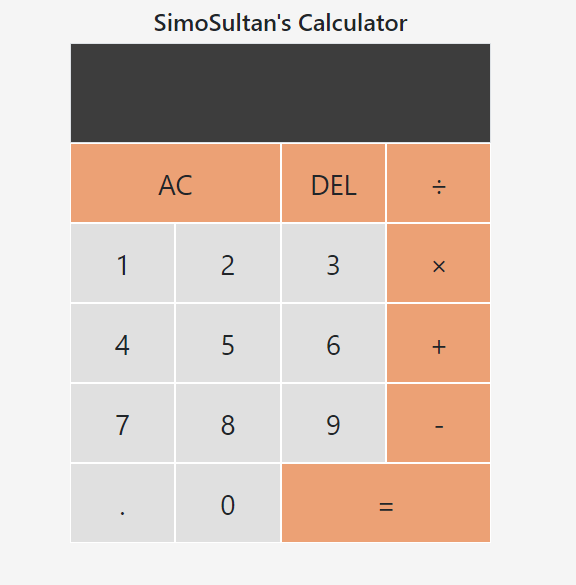

# SimoSultans Calculator

See it in action [here](https://simosultan-calculator.netlify.app/)

  
  

## Description

As part of one of our daily challenges we were tasked to use TDD to build a calculator. This has ALWAYS been one of my goals with programming, so I wanted to implement a front end for the calculator. So here it is...  
UPDATE: So I have to be honest, my weakness came through of impatience to code and I built the app first. But still have written tests post deploy (currently in progress writing them)

---

## Stack
- HTML
- Bootstrap
- JavaScript

---

## Current Functionality
- ability to calculate any 2 numbers
- clear the screen to start again
- remove the last character that was inputted
- if no operand is given it will just return whatever number has been originally inputted
- if neither number is given, it will assume 0 as the number
- handles decimal numbers

## Future Features
- allowing multiple operands
- keeps answers in history to start a follow up operand on it
- keeps a history of all calculations

---

## Author
Simon Curran  
[www.simonmcurran.com](https://www.simonmcurran.com/)  
